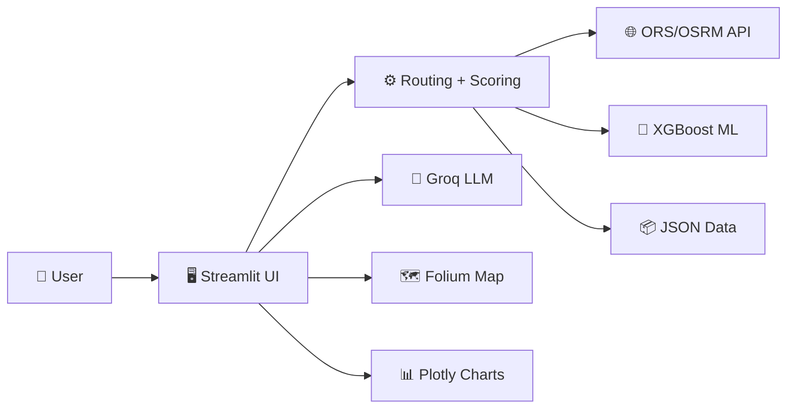

# 🧭 Safar AI — Smart Route Predictor

> **Pakistan's first AI-powered smart route predictor.** Predicts road blockages using ML & NLP, calculates real-time fuel costs in PKR, scores route safety, generates Smart Travel Reports via Groq AI, and answers queries in Urdu/English via AI agent "Raasta".

[](https://streamlit.io)
[](https://groq.com)
[](LICENSE)
[](https://python.org)
[](https://xgboost.readthedocs.io)

🔗 **Live Demo:** [safar-ai-smart-route.streamlit.app]([https://safar-ai-smart-route.streamlit.app/])

---

## ✨ Features

| Feature | Description |
|---|---|
| 🛰️ **Smart Multi-Route Fetching** | Fetches up to 3 alternative routes via OpenRouteService API with OSRM fallback |
| 🧠 **AI Scoring Engine** | Weighted scoring (time, distance, safety, congestion, cost) — scores 85-95/100 |
| 🤖 **ML Blockage Predictor** | XGBoost model trained on Pakistan traffic patterns (5000 synthetic samples) |
| 🗺️ **Interactive Map** | Folium dark map with color-coded routes, blockage markers, rest areas |
| 📊 **Analytics Dashboard** | Plotly charts — route comparison, safety gauge, cost breakdown, ETA bars |
| 📝 **Groq AI Travel Report** | Deep analysis via Llama 3.3 70B with risks, tips, and recommendations |
| 💬 **Raasta Chatbot** | AI travel assistant (English + Urdu) with route-context awareness |
| 📥 **Downloadable Reports** | Professional HTML travel report with one-click download |
| 📜 **Route History** | Session-based search history with comparison |
| 🛡️ **Safety Index** | Region + time + road type scoring (0-100 scale) |
| 💰 **PKR Cost Calculator** | Real-time fuel prices (Rs. 399.86/L petrol) + toll estimation for 8 vehicle types |

---

## 🏗️ System Architecture



> 📂 **Full diagrams available in [`docs/`](docs/)** — see [Documentation](#-documentation) section below.

---

## 🚀 Quick Start

### 1. Clone the Repository

```bash
git clone https://github.com/hamzaali-712/Safar-AI-Smart-Route-Predictor.git
cd Safar-AI-Smart-Route-Predictor
```

### 2. Install Dependencies

```bash
pip install -r requirements.txt
```

### 3. Set Up API Keys

Copy `.env.example` to `.env` and fill in your keys:

```bash
cp .env.example .env
```

| Key | Source | Free? |
|---|---|---|
| `ORS_API_KEY` | [openrouteservice.org](https://openrouteservice.org) | ✅ 2,000 req/day |
| `GROQ_API_KEY` | [console.groq.com](https://console.groq.com) | ✅ Free tier |

### 4. Run the App

```bash
streamlit run app.py
```

---

## 📁 Project Structure

```
Safar-AI-Smart-Route-Predictor/
├── app.py                  # Main Streamlit entry point
├── requirements.txt        # Python dependencies
├── .streamlit/config.toml  # Theme & server config
│
├── agent/                  # 💬 Raasta AI Chatbot
│   ├── raasta.py           # Chat logic with Groq
│   ├── intent.py           # Intent classification (6 categories)
│   └── language.py         # Urdu/English detection (langdetect)
│
├── engine/                 # ⚙️ Route Intelligence Engine
│   ├── routing.py          # ORS + OSRM API integration
│   ├── scoring.py          # Weighted multi-factor scoring
│   ├── safety.py           # Safety index calculator
│   ├── cost.py             # Fuel & toll cost (PKR)
│   ├── eta.py              # ETA with congestion factors
│   └── blockage.py         # Blockage zone checker (Haversine)
│
├── ml/                     # 🤖 Machine Learning
│   ├── train_blockage.py   # XGBoost training (synthetic data)
│   ├── predict.py          # Blockage inference
│   └── models/             # Saved model files (.joblib)
│
├── map/                    # 🗺️ Map Visualization
│   ├── base_map.py         # Folium dark map
│   ├── route_layer.py      # Route polylines (color-coded)
│   ├── blockage_layer.py   # Blockage warning markers
│   └── poi_layer.py        # Rest area markers
│
├── groq_ai/                # 🧠 Groq LLM Integration
│   ├── report.py           # Travel report generator
│   └── chat.py             # Chat completion wrapper
│
├── dashboard/              # 📊 Charts & Widgets
│   ├── charts.py           # Plotly visualizations
│   └── widgets.py          # Streamlit UI components
│
├── email_service/          # 📥 Report Download
│   └── sender.py           # HTML report builder
│
├── database/               # 📜 Session History
│   └── db.py               # JSON session storage
│
├── data/                   # 📦 Static Data Files
│   ├── pakistan_cities.json # 30+ cities with coordinates
│   ├── fuel_prices.json    # Current PKR fuel & toll rates
│   ├── vehicle_config.json # 8 vehicle types
│   ├── safety_index.json   # Regional safety scores
│   ├── blockages.json      # Known blockage hotspots
│   └── rest_areas.json     # Motorway rest stops
│
├── utils/                  # 🔧 Shared Utilities
│   └── helpers.py          # Geocoding, formatting, data loading
│
└── docs/                   # 📐 Documentation & Diagrams
    ├── system_architecture.md
    ├── class_diagram.md
    ├── flow_diagram.md
    ├── sequence_diagram.md
    ├── component_and_data_diagrams.md
    └── implementation_plan.md
```

---

## 🧮 Route Scoring Algorithm

```
Score = (0.30 × Time) + (0.15 × Distance) + (0.25 × Safety) + (0.20 × Congestion) + (0.10 × Cost)
```

| Factor | Weight | Method |
|--------|--------|--------|
| ⏱️ Time | 30% | ETA adjusted for rush hour, Friday prayers, night travel |
| 📏 Distance | 15% | Shortest route preferred |
| 🛡️ Safety | 25% | Region + road type + time-of-day scoring |
| 🚗 Congestion | 20% | XGBoost ML prediction (0-100% probability) |
| 💰 Cost | 10% | Fuel (current PKR rates) + toll charges |

Best route scores **85-95/100** under normal conditions.

---

## 📐 Documentation

Comprehensive technical diagrams are available in the [`docs/`](docs/) folder:

| Document | Description |
|----------|-------------|
| [System Architecture](docs/system_architecture.md) | High-level architecture with all layers and data flows |
| [Class Diagram](docs/class_diagram.md) | All modules, methods, attributes, and relationships |
| [Flow Diagrams](docs/flow_diagram.md) | User flow, API routing, ML prediction, chatbot, scoring |
| [Sequence Diagrams](docs/sequence_diagram.md) | Route search and chat interaction sequences |
| [Component & Data Diagrams](docs/component_and_data_diagrams.md) | Component, deployment, data flow, and ER diagrams |
| [Implementation Plan](docs/implementation_plan.md) | Development phases and milestones |

---

## 🌐 Streamlit Cloud Deployment

1. Push your repo to GitHub
2. Go to [share.streamlit.io](https://share.streamlit.io)
3. Connect your repo and set **`app.py`** as the main file
4. Add secrets in **Settings → Secrets**:

```toml
ORS_API_KEY = "your_key"
GROQ_API_KEY = "your_key"
```

---

## 🛠️ Tech Stack

| Layer | Technology |
|-------|-----------|
| **Frontend** | Streamlit 1.57+ |
| **Maps** | Folium + streamlit-folium |
| **Routing** | OpenRouteService API + OSRM (fallback) |
| **LLM** | Groq (Llama 3.3 70B Versatile) |
| **ML** | XGBoost + scikit-learn |
| **Charts** | Plotly |
| **NLP** | langdetect + fuzzywuzzy |
| **Reports** | Downloadable HTML |
| **Data** | JSON flat files |

---

## 👥 Team

| Name | Role |
|------|------|
| **Hamza Ali** | Lead Developer |

---

## 📄 License

This project is licensed under the MIT License — see [LICENSE](LICENSE) for details.

---

<p align="center">
  Made with ❤️ in Pakistan — <strong>Safar AI</strong> © 2026
</p>
