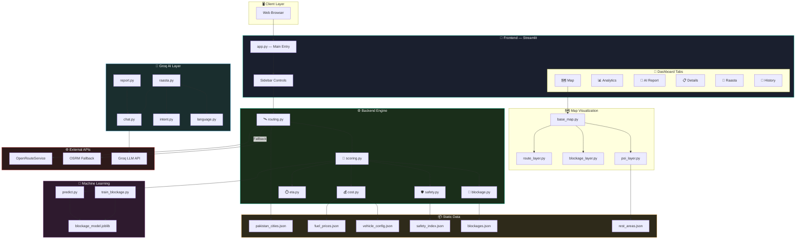
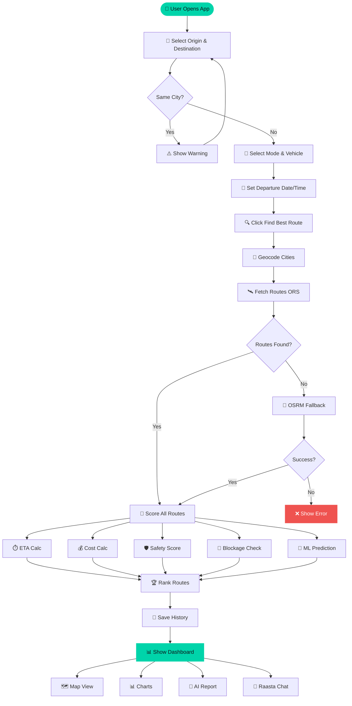
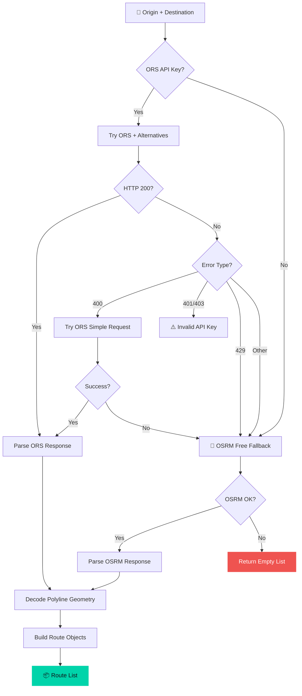
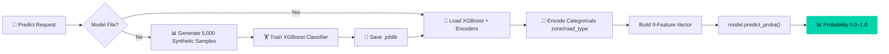
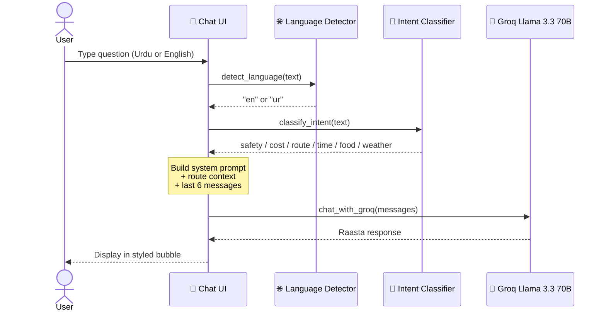
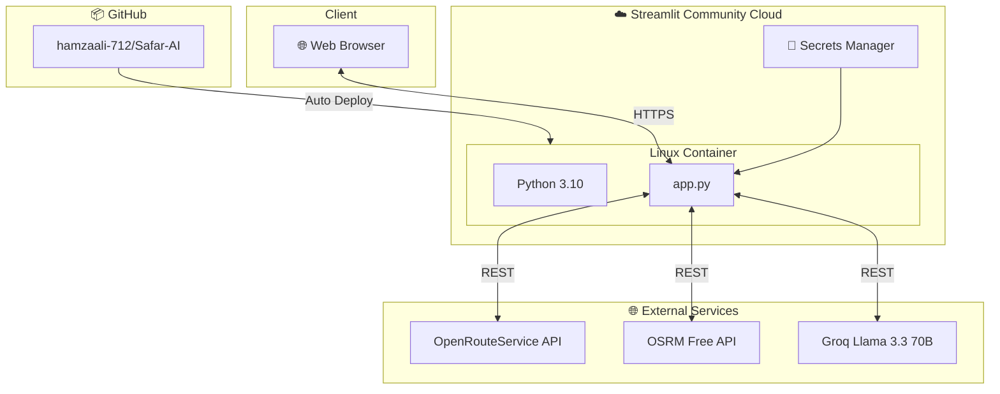

<div align="center">

<!-- HERO BANNER -->


<!-- BADGES ROW 1 -->
<p align="center">
  <a href="https://safar-ai-smart-route.streamlit.app/">
    
  </a>
  <a href="https://github.com/hamzaali-712/Safar-AI-Smart-Route-Predictor">
    
  </a>
  <a href="LICENSE">
    
  </a>
</p>

<!-- BADGES ROW 2 -->
<p align="center">
  
  
  
  
  
</p>

<!-- BADGES ROW 3 -->
<p align="center">
  
  
  
  
</p>

<br/>

<!-- TAGLINE -->
> ### 🌟 *AI-scored multi-route comparison · XGBoost congestion prediction · Groq LLM travel reports · Real-time PKR cost calculator · Urdu/English chatbot "Raasta"*

<br/>

</div>

---

## 📋 Table of Contents

<div align="center">

| Section | Description |
|:-------:|:-----------:|
| [✨ Features](#-features) | Full capability overview |
| [🎬 Demo](#-demo) | Screenshots & live preview |
| [🏗️ Architecture](#%EF%B8%8F-system-architecture) | System design & layers |
| [📐 Flow Diagrams](#-flow-diagrams) | All process flows |
| [🧮 Scoring Algorithm](#-route-scoring-algorithm) | AI scoring formula |
| [🤖 ML Model](#-machine-learning-engine) | XGBoost blockage predictor |
| [📦 Tech Stack](#-tech-stack) | All tools & libraries |
| [🚀 Quick Start](#-quick-start) | Get running in 5 min |
| [⚙️ Configuration](#%EF%B8%8F-configuration) | API keys & secrets |
| [🌐 Deployment](#-streamlit-cloud-deployment) | Deploy to cloud |
| [📁 Project Structure](#-project-structure) | Directory layout |
| [📊 Data Files](#-static-data-files) | JSON data reference |
| [🧪 Testing](#-testing) | Verification plan |
| [👥 Contributing](#-contributing) | How to contribute |

</div>

---

## ✨ Features

<div align="center">

```
╔══════════════════════════════════════════════════════════════════════════════╗
║                        🧭 SAFAR AI  FEATURE MATRIX                         ║
╠══════════════════════╦══════════════════════════════════════════════════════╣
║  🛰️ Smart Routing    ║  Up to 3 alternative routes · ORS + OSRM fallback   ║
║  🧠 AI Scoring       ║  5-factor weighted engine · 85–95/100 best route     ║
║  🤖 ML Prediction    ║  XGBoost on 5,000 synthetic Pakistan traffic samples ║
║  🗺️ Interactive Map  ║  Folium dark map · color routes · blockage markers   ║
║  📊 Analytics        ║  Plotly charts · gauge · comparison · cost breakdown ║
║  📝 AI Reports       ║  Groq Llama 3.3 70B · risks · tips · PKR costs       ║
║  💬 Raasta Chat      ║  Bilingual AI assistant · Urdu + English support      ║
║  📥 Report Download  ║  Professional HTML report · one-click export          ║
║  📜 Route History    ║  Session-based search history with comparisons        ║
║  🛡️ Safety Index     ║  Region + road type + time-of-day 0–100 scoring      ║
║  💰 PKR Calculator   ║  Live fuel rates + toll charges · 8 vehicle types     ║
╚══════════════════════╩══════════════════════════════════════════════════════╝
```

</div>

### 🛰️ Core Capabilities At a Glance

<table>
<tr>
<td width="33%">

#### 🗺️ Smart Route Fetching
- **OpenRouteService API** primary routing
- **OSRM fallback** — always works, no key needed
- Up to **3 alternative routes** per search
- Encoded polyline geometry decoding
- Turn-by-turn step instructions

</td>
<td width="33%">

#### 🧠 AI Scoring Engine
- **5-factor weighted algorithm** (Time 30%, Distance 15%, Safety 25%, Congestion 20%, Cost 10%)
- Ratio-based normalization
- Scores normalized to **0–100 scale**
- Highest score = recommended route
- Full breakdown per factor

</td>
<td width="33%">

#### 💬 Raasta — AI Chatbot
- Powered by **Groq Llama 3.3 70B**
- Detects **Urdu vs English** input
- Classifies **6 intent categories** (safety, time, cost, weather, route, food)
- Full **route context awareness**
- Last 6 messages conversation memory

</td>
</tr>
<tr>
<td>

#### 🤖 ML Blockage Predictor
- **XGBoost classifier** trained on 5,000 synthetic samples
- Pakistan-specific patterns (monsoon, Friday prayers, rush hour)
- 9 features: hour, day, month, weekend, rush hour, zone, road type, distance, weather risk
- Returns **0.0–1.0 probability** of congestion
- Auto-trains if no saved model found

</td>
<td>

#### 🛡️ Safety Intelligence
- **Region-based scores**: Punjab 75, ICT 85, Balochistan 45…
- Road type modifiers: Motorway +15, Rural −10, Mountain −20
- Time-of-day modifiers (daytime safest +10, night −15)
- Night penalty per province
- Long-distance fatigue penalty (>500 km −10)

</td>
<td>

#### 💰 Cost Calculator
- **Real-time PKR fuel prices**: Petrol Rs.399.86/L, Diesel Rs.399.58/L, CNG Rs.290/kg
- **8 vehicle types**: Sedan, Hatchback, SUV, Motorcycle, Rickshaw, Bus, Truck, EV
- Motorway-specific toll rates (M-1 through M-14)
- Per-km rate calculation
- Fuel + Toll = Total cost breakdown

</td>
</tr>
</table>

---

## 🎬 Demo

<div align="center">

### 🌐 Live Application
**[🚀 safar-ai-smart-route.streamlit.app](https://safar-ai-smart-route.streamlit.app/)**

</div>

### 📱 Application Flow

```
┌─────────────────────────────────────────────────────────────────────┐
│                        🧭 SAFAR AI — USER JOURNEY                  │
├─────────────────────────────────────────────────────────────────────┤
│                                                                     │
│  1️⃣  SELECT TRIP                                                    │
│     📍 Origin City → 🏁 Destination → 🚗 Mode → 🚙 Vehicle → 📅 Time │
│                            ↓                                        │
│  2️⃣  AI PROCESSING                                                  │
│     🛰️ Fetch Routes (ORS/OSRM) → 🧠 Score Routes → 📊 Rank Results  │
│                            ↓                                        │
│  3️⃣  DASHBOARD TABS                                                 │
│     🗺️ MAP  │  📊 CHARTS  │  📝 AI REPORT  │  📋 DETAILS  │  💬 CHAT │
│                            ↓                                        │
│  4️⃣  ACTIONS                                                        │
│     📥 Download Report   │   💬 Ask Raasta   │   📜 View History    │
│                                                                     │
└─────────────────────────────────────────────────────────────────────┘
```

---

## 🏗️ System Architecture



---

## 📐 Flow Diagrams

### 1️⃣ Main User Flow



### 2️⃣ API Routing & Fallback



### 3️⃣ ML Prediction Pipeline



### 4️⃣ Raasta Chatbot Flow



---

## 🧮 Route Scoring Algorithm

<div align="center">

```
╔══════════════════════════════════════════════════════════════════════╗
║              SAFAR AI — WEIGHTED SCORING FORMULA                    ║
╠══════════════════════════════════════════════════════════════════════╣
║                                                                     ║
║  Score = (0.30 × Time) + (0.15 × Distance) + (0.25 × Safety)       ║
║        + (0.20 × Congestion) + (0.10 × Cost)                       ║
║                                                                     ║
║  All factors normalized 0.0–1.0 using ratio-based method           ║
║  Final score multiplied × 100 → displayed as 0–100                 ║
╚══════════════════════════════════════════════════════════════════════╝
```

</div>

| Factor | Weight | Calculation Method | Best → Worst |
|:------:|:------:|:------------------:|:------------:|
| ⏱️ **Time Score** | **30%** | `min_time / route_eta_min` | Fastest = 1.0 |
| 📏 **Distance Score** | **15%** | `min_dist / route_dist_km` | Shortest = 1.0 |
| 🛡️ **Safety Score** | **25%** | `safety_score / 100` from regional index | Region + Road + Time |
| 🚗 **Congestion Score** | **20%** | `1 - ml_blockage_probability` | 0% congestion = 1.0 |
| 💰 **Cost Score** | **10%** | `min_cost / route_total_cost_pkr` | Cheapest = 1.0 |

### 🛡️ Safety Score Breakdown

```
Safety Score = Base Region Score
             + Road Type Modifier
             + Time-of-Day Modifier
             + Night Penalty (if hour ≥ 20 or ≤ 5)
             + Long-Distance Fatigue Penalty (if distance > 300 km)
```

| Province | Base Score | Night Penalty |
|:--------:|:----------:|:-------------:|
| 🏛️ ICT (Islamabad) | 85 | −10 |
| 🌾 Punjab | 75 | −15 |
| 🌊 Sindh | 65 | −20 |
| 🏔️ KPK | 60 | −18 |
| 🏔️ GB | 55 | −30 |
| 🗺️ AJK | 58 | −22 |
| 🏜️ Balochistan | 45 | −25 |

---

## 🤖 Machine Learning Engine

### XGBoost Blockage Predictor

```mermaid
graph LR
    subgraph Features["📊 9 Input Features"]
        F1["🕐 hour 0–23"]
        F2["📅 day_of_week 0–6"]
        F3["📆 month 1–12"]
        F4["🏖️ is_weekend bool"]
        F5["🚦 is_rush_hour bool"]
        F6["🏙️ zone urban/semi/rural"]
        F7["🛣️ road_type highway/motorway/urban/rural"]
        F8["📏 distance_km float"]
        F9["🌧️ weather_risk 0.0–1.0"]
    end

    subgraph Model["🤖 XGBoost Classifier"]
        XGB["n_estimators=100<br/>max_depth=5<br/>learning_rate=0.1"]
    end

    subgraph Output["📊 Output"]
        Prob["Blockage Probability<br/>0.0 → 1.0"]
    end

    Features --> Model --> Output

    style Model fill:#2E1A2E,stroke:#CE93D8,color:#FAFAFA
    style Output fill:#1A2E1A,stroke:#00D4AA,color:#FAFAFA
```



### 🌦️ Pakistan-Specific Weather Risk by Month

| Month | Risk | Reason |
|:-----:|:----:|:------:|
| Jul–Aug | **0.80–0.85** 🔴 | Monsoon Peak |
| Sep | **0.60** 🟠 | Monsoon Tail |
| Jan | **0.50** 🟡 | Dense Fog |
| Dec | **0.55** 🟡 | Winter Fog |
| Nov | **0.30** 🟢 | Smog Season |
| Mar–Apr | **0.20** 🟢 | Clear Skies |

### 📊 Synthetic Training Data Patterns

```
Pakistan Rush Hours:     7–9 AM, 5–8 PM  → +0.30 blockage probability
Urban Zone:              50% samples      → +0.15 probability
Friday Prayers:          12–2 PM Fri      → +0.25 probability spike
Motorway Roads:          -0.15 adjustment → Safer than urban
Late Night (10PM–4AM):   -0.15 adjustment → Less traffic
Weekend bonus:           -0.05 adjustment → Fewer commuters
```

---

## 📦 Tech Stack

<div align="center">

| Layer | Technology | Version | Purpose |
|:-----:|:----------:|:-------:|:-------:|
| 🎨 **Frontend** |  | ≥1.32.0 | UI Framework |
| 🗺️ **Maps** |  | ≥0.15.0 | Interactive Maps |
| 🗺️ **Map Widget** | `streamlit-folium` | ≥0.18.0 | Embed Folium in Streamlit |
| 🌐 **Routing** | OpenRouteService API | REST | Multi-route Directions |
| 🔄 **Fallback** | OSRM API | REST | Free Routing Fallback |
| 📍 **Geocoding** |  | ≥2.4.0 | Address → Coordinates |
| 🧠 **LLM** |  | ≥0.4.0 | Llama 3.3 70B Reports |
| 🤖 **ML** |  | ≥2.0.0 | Congestion Prediction |
| 📊 **ML Framework** |  | ≥1.3.0 | Model Training |
| 📊 **Charts** |  | ≥5.18.0 | Interactive Charts |
| 🐼 **Data** |  | ≥2.1.0 | Data Processing |
| 🔢 **Numerics** |  | ≥1.24.0 | Array Operations |
| 🌐 **HTTP** |  | ≥2.31.0 | API Calls |
| 🗣️ **NLP** | `langdetect` | ≥1.0.9 | Urdu/English Detection |
| 🔍 **Fuzzy Match** | `fuzzywuzzy` | ≥0.18.0 | City Name Matching |
| 💾 **Serialization** | `joblib` | ≥1.3.0 | Save/Load ML Models |
| ⚙️ **Config** | `python-dotenv` | ≥1.0.0 | Environment Variables |

</div>

---

## 🚀 Quick Start

### Prerequisites

```bash
# Check Python version (3.10+ required)
python --version

# Verify pip is available
pip --version
```

### 1️⃣ Clone the Repository

```bash
git clone https://github.com/hamzaali-712/Safar-AI-Smart-Route-Predictor.git
cd Safar-AI-Smart-Route-Predictor
```

### 2️⃣ Create Virtual Environment (Recommended)

```bash
# Create venv
python -m venv venv

# Activate (Linux/macOS)
source venv/bin/activate

# Activate (Windows)
venv\Scripts\activate
```

### 3️⃣ Install Dependencies

```bash
pip install -r requirements.txt
```

<details>
<summary>📋 <strong>Full requirements.txt</strong> (click to expand)</summary>

```txt
# Frontend
streamlit>=1.32.0
streamlit-folium>=0.18.0,<0.26.0

# Maps & GIS
folium>=0.15.0,<0.20.0

# Data
pandas>=2.1.0
numpy>=1.24.0

# Machine Learning
scikit-learn>=1.3.0
joblib>=1.3.0
xgboost>=2.0.0

# NLP
langdetect>=1.0.9
fuzzywuzzy>=0.18.0
python-Levenshtein>=0.21.0

# Charts
plotly>=5.18.0

# HTTP
requests>=2.31.0

# Utilities
python-dotenv>=1.0.0
geopy>=2.4.0

# LLM
groq>=0.4.0
```

</details>

### 4️⃣ Configure API Keys

```bash
# Copy the example env file
cp .env.example .env
```

Edit `.env`:

```env
ORS_API_KEY=your_openrouteservice_key_here
GROQ_API_KEY=your_groq_api_key_here
```

### 5️⃣ Run the Application

```bash
streamlit run app.py
```

The app opens automatically at **http://localhost:8501** 🎉

---

## ⚙️ Configuration

### 🔑 API Keys Required

| Key | Source | Free Tier | Purpose |
|:---:|:------:|:---------:|:-------:|
| `ORS_API_KEY` | [openrouteservice.org](https://openrouteservice.org) | ✅ 2,000 req/day | Multi-route directions & geocoding |
| `GROQ_API_KEY` | [console.groq.com](https://console.groq.com) | ✅ Free tier | AI travel reports & Raasta chatbot |

> **Note:** The app works **without** `ORS_API_KEY` — OSRM fallback provides free routing automatically.

> **Note:** Without `GROQ_API_KEY`, the AI Report and Raasta chat will show a configuration warning, but all other features (map, scoring, charts) work fully.

### 🎨 Streamlit Theme (`.streamlit/config.toml`)

```toml
[theme]
primaryColor       = "#00D4AA"    # Teal accent
backgroundColor    = "#0E1117"    # Dark background
secondaryBackgroundColor = "#1A1F2E"  # Card background
textColor          = "#FAFAFA"    # Light text
font               = "sans serif"

[server]
headless           = true
enableCORS         = false
enableXsrfProtection = true
```

---

## 🌐 Streamlit Cloud Deployment

### 1. Push to GitHub

```bash
git add .
git commit -m "🚀 Deploy Safar AI"
git push origin main
```

### 2. Deploy on Streamlit Cloud

1. Visit [share.streamlit.io](https://share.streamlit.io)
2. Click **New App** → Connect GitHub repo
3. Set **Main file path**: `app.py`
4. Click **Deploy**

### 3. Add Secrets

In Streamlit Cloud → **Settings → Secrets**, add:

```toml
ORS_API_KEY = "your_ors_key"
GROQ_API_KEY = "your_groq_key"
```

### 🐳 Deployment Architecture



---

## 📁 Project Structure

```
🧭 Safar-AI-Smart-Route-Predictor/
│
├── 📄 app.py                          # Main Streamlit entry point
├── 📄 requirements.txt                # Python dependencies
├── 📄 .env.example                    # Environment template
├── 📄 .gitignore                      # Git ignore rules
├── 📄 LICENSE                         # MIT License
│
├── ⚙️ .streamlit/
│   └── config.toml                    # Dark theme + server config
│
├── 🤖 agent/                          # Raasta AI Chatbot Module
│   ├── __init__.py
│   ├── raasta.py                      # Groq-powered chatbot logic
│   ├── intent.py                      # 6-category intent classifier
│   └── language.py                    # Urdu/English detection
│
├── ⚙️ engine/                         # Core Route Intelligence Engine
│   ├── __init__.py
│   ├── routing.py                     # ORS + OSRM API integration
│   ├── scoring.py                     # 5-factor weighted scoring
│   ├── safety.py                      # Safety index calculator
│   ├── cost.py                        # PKR fuel + toll calculator
│   ├── eta.py                         # ETA + congestion adjustment
│   └── blockage.py                    # Haversine blockage checker
│
├── 🤖 ml/                             # Machine Learning Module
│   ├── __init__.py
│   ├── train_blockage.py              # Synthetic data + XGBoost training
│   ├── predict.py                     # Blockage inference engine
│   └── models/                        # Saved .joblib model files
│       ├── blockage_model.joblib      # (auto-generated at runtime)
│       └── label_encoders.joblib      # (auto-generated at runtime)
│
├── 🗺️ map/                            # Map Visualization Module
│   ├── __init__.py
│   ├── base_map.py                    # Folium dark map creator
│   ├── route_layer.py                 # Color-coded route polylines
│   ├── blockage_layer.py              # Warning markers
│   ├── heatmap_layer.py               # Congestion heatmap (extensible)
│   └── poi_layer.py                   # Rest areas + fuel stations
│
├── 🧠 groq_ai/                        # Groq LLM Integration
│   ├── __init__.py
│   ├── report.py                      # Smart Travel Report generator
│   └── chat.py                        # Chat completion wrapper
│
├── 📊 dashboard/                      # Dashboard Charts & Widgets
│   ├── __init__.py
│   ├── charts.py                      # Plotly bar, gauge, pie, horizontal bars
│   └── widgets.py                     # Metric cards + route detail expanders
│
├── 📥 email_service/                  # Report Download Module
│   ├── __init__.py
│   └── sender.py                      # HTML report builder
│
├── 💾 database/                       # Session Storage
│   ├── __init__.py
│   └── db.py                          # JSON session history (no SQLite)
│
├── 🔧 utils/                          # Shared Utilities
│   ├── __init__.py
│   └── helpers.py                     # Geocoding, formatting, data loaders
│
├── 📦 data/                           # Static Data Files (JSON)
│   ├── pakistan_cities.json           # 30 cities + lat/lng/province/zone
│   ├── fuel_prices.json               # Live PKR rates + toll tables
│   ├── vehicle_config.json            # 8 vehicle types + consumption
│   ├── safety_index.json              # Regional safety + modifiers
│   ├── blockages.json                 # 10 known blockage hotspots
│   └── rest_areas.json                # 10 motorway rest stops
│
├── 🧪 test_routing.py                 # Quick OSRM + ORS test script
│
└── 📐 docs/                           # Technical Documentation
    ├── README.md
    ├── system_architecture.md
    ├── class_diagram.md
    ├── flow_diagram.md
    ├── sequence_diagram.md
    ├── component_and_data_diagrams.md
    └── implementation_plan.md
```

---

## 📊 Static Data Files

### 🏙️ Pakistan Cities Coverage (`pakistan_cities.json`)

<details>
<summary>📍 <strong>30 Cities Covered</strong> (click to expand)</summary>

| City | Province | Zone | Lat | Lng |
|:----:|:--------:|:----:|:---:|:---:|
| Lahore | Punjab | Urban | 31.5204 | 74.3587 |
| Islamabad | ICT | Urban | 33.6844 | 73.0479 |
| Karachi | Sindh | Urban | 24.8607 | 67.0011 |
| Rawalpindi | Punjab | Urban | 33.5651 | 73.0169 |
| Faisalabad | Punjab | Urban | 31.4504 | 73.1350 |
| Multan | Punjab | Urban | 30.1575 | 71.5249 |
| Peshawar | KPK | Urban | 34.0151 | 71.5249 |
| Quetta | Balochistan | Urban | 30.1798 | 66.9750 |
| Hunza | GB | Rural | 36.3167 | 74.6500 |
| Skardu | GB | Rural | 35.2971 | 75.6333 |
| Gilgit | GB | Rural | 35.8819 | 74.4643 |
| Chitral | KPK | Rural | 35.8518 | 71.7864 |
| Naran | KPK | Rural | 34.9091 | 73.6508 |
| Murree | Punjab | Rural | 33.9070 | 73.3943 |
| Swat | KPK | Rural | 35.2227 | 72.3525 |
| Abbottabad | KPK | Semi-Urban | 34.1688 | 73.2215 |
| Muzaffarabad | AJK | Semi-Urban | 34.3700 | 73.4711 |
| *...and 13 more* | | | | |

</details>

### 🚗 Vehicle Types (`vehicle_config.json`)

| Vehicle | Fuel | Consumption | Label |
|:-------:|:----:|:-----------:|:-----:|
| 🚗 sedan | Petrol | 10.0 L/100km | Corolla/Civic |
| 🚙 hatchback | Petrol | 7.5 L/100km | Alto/Cultus |
| 🚐 suv | Petrol | 14.0 L/100km | Fortuner/Sportage |
| 🏍️ motorcycle | Petrol | 3.0 L/100km | 70cc/125cc |
| 🛺 rickshaw | CNG | 5.0 kg/100km | CNG Rickshaw |
| 🚌 bus | Diesel | 25.0 L/100km | Bus/Coach |
| 🚛 truck | Diesel | 35.0 L/100km | Cargo Truck |
| ⚡ electric | Electric | 15.0 kWh/100km | EV |

### ⛽ Fuel Prices (May 2026, PKR)

| Fuel | Price |
|:----:|:-----:|
| ⛽ Petrol | Rs. 399.86 / Liter |
| 🛢️ Diesel | Rs. 399.58 / Liter |
| 🔵 CNG | Rs. 290.00 / kg |
| ⚡ Electric | Rs. 55.00 / kWh |

---

## 🧪 Testing

### Quick Routing Test

```bash
# Test OSRM fallback (no API key needed)
python test_routing.py
```

Expected output:
```
==================================================
Testing OSRM (free fallback) - Lahore to Islamabad
==================================================
HTTP Status: 200
OSRM Code: Ok
Routes found: 3
  Route 1: 375.2 km, 245.0 min
  Route 2: 392.1 km, 262.5 min
  Route 3: 410.8 km, 278.3 min

✅ OSRM FALLBACK WORKS!
```

### ML Model Training Test

```bash
# Trigger model training manually
python -c "from ml.train_blockage import train_model; acc = train_model(); print(f'Accuracy: {acc:.2%}')"
```

### Verification Checklist

```
✅ streamlit run app.py — app loads on localhost:8501
✅ ORS routes returned for Lahore → Islamabad
✅ OSRM fallback works without ORS key
✅ XGBoost model trains if models/ folder empty
✅ Groq report generates with valid API key
✅ Map renders with dark CartoDB tiles
✅ Route scoring returns scores between 0–100
✅ PKR cost calculation matches expected values
✅ Raasta responds in correct language (Urdu/English)
✅ History saves and renders correctly
✅ HTML report downloads via browser
✅ Streamlit Cloud secrets correctly loaded
```

---

## 📐 Module Reference

### `engine/scoring.py` — Scoring Formula

```python
final_score = (
    0.30 * max(0, time_score)       +   # Fastest route wins
    0.15 * max(0, dist_score)       +   # Shortest preferred
    0.25 * max(0, safety_score)     +   # Safety matters most with time
    0.20 * max(0, congestion_score) +   # ML prediction
    0.10 * max(0, cost_score)           # PKR cost factor
)
route["final_score"] = round(final_score * 100, 1)
```

### `ml/predict.py` — Blockage Inference

```python
features = [hour, day_of_week, month, is_weekend, is_rush_hour,
            zone_encoded, road_type_encoded, distance_km, weather_risk]
proba = model.predict_proba([features])
blockage_probability = proba[0][1]   # Class 1 = blocked
```

### `groq_ai/report.py` — Report Generation

```python
# System prompt enforces 6 required sections:
# 🏆 Recommended Route
# 📊 Route Analysis
# ⚠️ Risk Assessment
# 🔄 Alternative Routes
# 💡 Personalized Travel Tips
# 💰 Cost Breakdown
```

### `agent/intent.py` — Intent Classification

| Intent | Keywords |
|:------:|:--------:|
| `safety` | safe, danger, risk, night, mehfooz, khatrnak |
| `time` | best time, when, kab, waqt, rush hour |
| `cost` | cost, fuel, toll, kitna kharch, paisa |
| `weather` | weather, rain, monsoon, fog, barish, dhund |
| `route` | route, road, motorway, highway, rasta |
| `food` | food, dhaba, khana, rest area, hotel |
| `general` | (fallback) |

---

## 🤝 Contributing

Contributions are welcome! Here's how to get started:

```bash
# 1. Fork the repository
# 2. Create your feature branch
git checkout -b feature/AmazingFeature

# 3. Make your changes
# 4. Commit
git commit -m '✨ Add AmazingFeature'

# 5. Push
git push origin feature/AmazingFeature

# 6. Open a Pull Request
```

### 💡 Ideas for Contributions

- [ ] 🗺️ Add more Pakistan cities to `pakistan_cities.json`
- [ ] 🚧 Expand `blockages.json` with more hotspots
- [ ] 🌦️ Integrate a free weather API for real-time conditions
- [ ] 🔄 Add more vehicle types (wagon, van, mini-truck)
- [ ] 📊 Add route history export as CSV/PDF
- [ ] 🌍 Extend to support Afghanistan/India border crossings
- [ ] 🤖 Fine-tune ML model with real Pakistan traffic data
- [ ] 🌙 Add night mode / theme toggle

---

## 📄 License

```
MIT License — Copyright (c) 2026 Hamza Ali

Permission is hereby granted, free of charge, to any person obtaining a copy
of this software and associated documentation files (the "Software"), to deal
in the Software without restriction, including without limitation the rights
to use, copy, modify, merge, publish, distribute, sublicense, and/or sell
copies of the Software...
```

See [LICENSE](LICENSE) for full text.

---

## 🙏 Acknowledgements

| Tool | Credit |
|:----:|:------:|
| 🗺️ [OpenRouteService](https://openrouteservice.org) | Free routing API (2,000 req/day) |
| 🔄 [OSRM](http://project-osrm.org) | Free open-source routing fallback |
| 🧠 [Groq](https://groq.com) | Ultra-fast Llama 3.3 70B inference |
| 🍃 [Folium](https://python-visualization.github.io/folium/) | Python Leaflet.js maps |
| 📊 [Plotly](https://plotly.com) | Interactive Python charts |
| 🤖 [XGBoost](https://xgboost.readthedocs.io) | Gradient boosted trees ML |
| 🎈 [Streamlit](https://streamlit.io) | Python web app framework |
| 📍 [Geopy/Nominatim](https://geopy.readthedocs.io) | Open geocoding |

---

<div align="center">


**Made with ❤️ in Pakistan**

### 🧭 Safar AI — *Intelligent Routes for Pakistan* 🇵🇰

[](https://github.com/hamzaali-712/Safar-AI-Smart-Route-Predictor)
[](https://github.com/hamzaali-712/Safar-AI-Smart-Route-Predictor/fork)
[](https://github.com/hamzaali-712/Safar-AI-Smart-Route-Predictor)

*© 2026 Safar AI — MIT License*

</div>
