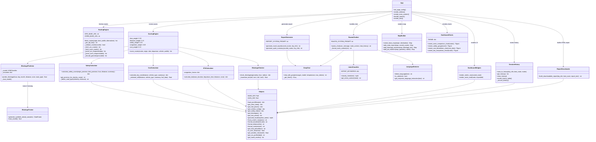

# 📐 Class Diagram

## Module Structure & Dependencies

```mermaid
classDiagram
    class App {
        +set_page_config()
        +render_sidebar()
        +render_main_content()
        +handle_search()
        +render_tabs()
    }

    class RoutingEngine {
        -ORS_BASE_URL: str
        -OSRM_BASE_URL: str
        +fetch_routes(origin, dest, profile, alternatives) list
        -_get_api_key() str
        -_validate_coords(coords) bool
        -_fetch_ors_routes() list
        -_fetch_osrm_routes() list
        -_parse_ors_response(data) list
        -_parse_osrm_response(data) list
        -_decode_geometry(encoded) list
    }

    class ScoringEngine {
        +score_routes(routes, origin, dest, departure, vehicle, profile) list
        -time_weight: 0.30
        -distance_weight: 0.15
        -safety_weight: 0.25
        -congestion_weight: 0.20
        -cost_weight: 0.10
    }

    class SafetyCalculator {
        +calculate_safety_score(origin_province, dest_province, hour, distance, summary) dict
        +get_province_for_city(city_name) str
        -_detect_road_type(summary, distance) str
    }

    class ETACalculator {
        +calculate_eta(base_duration, departure_time, distance, zone) dict
        -congestion_factors: dict
    }

    class CostCalculator {
        +calculate_trip_cost(distance, vehicle_type, summary) dict
        -_estimate_toll(distance, vehicle_type, summary, fuel_data) float
    }

    class BlockageChecker {
        +check_blockages(geometry, hour, radius) dict
        -_haversine_km(lat1, lon1, lat2, lon2) float
    }

    class BlockagePredictor {
        -_model: XGBClassifier
        -_encoders: dict
        +predict_blockage(hour, day, month, distance, zone, road_type) float
        -_load_model()
    }

    class BlockageTrainer {
        +generate_synthetic_data(n_samples) DataFrame
        +train_model() float
    }

    class GroqChat {
        +chat_with_groq(messages, model, temperature, max_tokens) str
        -_get_client() Groq
    }

    class ReportGenerator {
        -REPORT_SYSTEM_PROMPT: str
        +generate_travel_report(scored_routes, trip_info) str
        +generate_quick_summary(scored_routes, trip_info) str
    }

    class RaastaChatbot {
        -RAASTA_SYSTEM_PROMPT: str
        +raasta_chat(user_message, route_context, chat_history) str
        -_format_route_context(ctx) str
    }

    class IntentClassifier {
        -INTENT_KEYWORDS: dict
        +classify_intent(text) tuple
        +get_intent_context(intent) str
    }

    class LanguageDetector {
        +detect_language(text) str
        +is_urdu(text) bool
        +get_response_language_instruction(text) str
    }

    class MapBuilder {
        +create_base_map(origin, destination) Map
        +add_route_layers(map, scored_routes) Map
        +add_blockage_markers(map, blockage_info) Map
        +add_poi_markers(map, geometry, radius) Map
    }

    class DashboardCharts {
        -THEME: dict
        +create_route_comparison_chart(routes) Figure
        +create_safety_gauge(score) Figure
        +create_cost_breakdown_chart(cost_data) Figure
        +create_eta_comparison_chart(routes) Figure
    }

    class DashboardWidgets {
        +render_metric_row(scored_route)
        +render_route_card(route, expanded)
    }

    class Helpers {
        -BASE_DIR: Path
        -DATA_DIR: Path
        +load_json(filename) dict
        +get_cities_data() dict
        +get_fuel_prices() dict
        +get_vehicle_config() dict
        +get_safety_index() dict
        +get_blockages() list
        +get_rest_areas() list
        +geocode_location(place_name) tuple
        +fuzzy_match_city(query) str
        +format_duration(minutes) str
        +format_distance(km) str
        +format_cost(amount) str
        +get_time_period(hour) str
        +is_rush_hour(hour) bool
        +get_weather_risk(month) float
        +get_ors_profile(label) str
        +get_travel_modes() list
    }

    class SessionHistory {
        +save_to_history(trip_info, best_route, routes)
        +get_history() list
        +clear_history()
        +render_history_table()
        -_ensure_history()
    }

    class ReportDownloader {
        +build_downloadable_report(trip_info, best_route, report_text) str
    }

    App --> RoutingEngine : fetches routes
    App --> ScoringEngine : scores routes
    App --> MapBuilder : renders map
    App --> DashboardCharts : renders charts
    App --> DashboardWidgets : renders UI
    App --> ReportGenerator : generates report
    App --> RaastaChatbot : handles chat
    App --> SessionHistory : stores history
    App --> ReportDownloader : builds HTML report

    ScoringEngine --> ETACalculator
    ScoringEngine --> CostCalculator
    ScoringEngine --> SafetyCalculator
    ScoringEngine --> BlockageChecker
    ScoringEngine --> BlockagePredictor

    BlockagePredictor --> BlockageTrainer : trains if missing

    ReportGenerator --> GroqChat
    RaastaChatbot --> GroqChat
    RaastaChatbot --> IntentClassifier
    RaastaChatbot --> LanguageDetector

    SafetyCalculator --> Helpers
    CostCalculator --> Helpers
    ETACalculator --> Helpers
    BlockageChecker --> Helpers
    DashboardWidgets --> Helpers
    SessionHistory --> Helpers
    ReportDownloader --> Helpers
```
