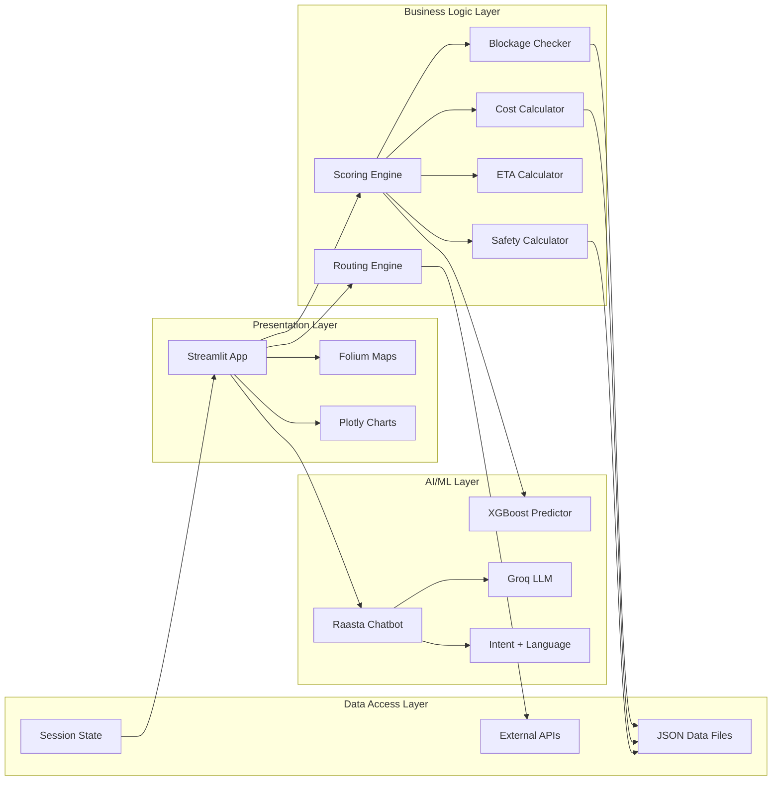
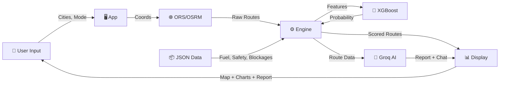
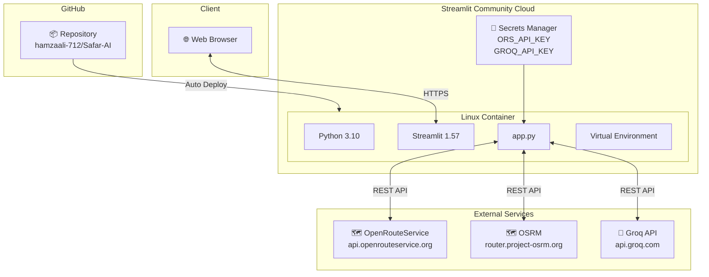
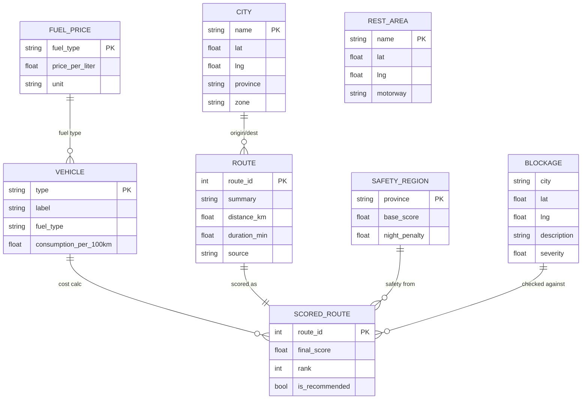

# 🧩 Component Diagram

```mermaid
graph LR
    subgraph Presentation["Presentation Layer"]
        ST["Streamlit App"]
        FOL["Folium Maps"]
        PLT["Plotly Charts"]
    end

    subgraph Business["Business Logic Layer"]
        RE["Routing Engine"]
        SE["Scoring Engine"]
        SC["Safety Calculator"]
        CC["Cost Calculator"]
        EC["ETA Calculator"]
        BC["Blockage Checker"]
    end

    subgraph Intelligence["AI/ML Layer"]
        XG["XGBoost Predictor"]
        GR["Groq LLM"]
        RA["Raasta Chatbot"]
        NLP["Intent + Language"]
    end

    subgraph DataAccess["Data Access Layer"]
        JSON["JSON Data Files"]
        SS["Session State"]
        API["External APIs"]
    end

    ST --> RE
    ST --> SE
    ST --> FOL
    ST --> PLT
    ST --> RA

    SE --> SC
    SE --> CC
    SE --> EC
    SE --> BC
    SE --> XG

    RA --> GR
    RA --> NLP

    RE --> API
    SC --> JSON
    CC --> JSON
    BC --> JSON
    SS --> ST
```

# 📊 Data Flow Diagram

```mermaid
flowchart LR
    User["👤 User Input"] --> |"Cities, Mode"| App["🖥️ App"]
    App --> |"Coords"| ORS["🌐 ORS/OSRM"]
    ORS --> |"Raw Routes"| Engine["⚙️ Engine"]
    
    DB["📦 JSON Data"] --> |"Fuel, Safety, Blockages"| Engine
    Engine --> |"Features"| ML["🤖 XGBoost"]
    ML --> |"Probability"| Engine
    
    Engine --> |"Scored Routes"| Display["📊 Display"]
    Engine --> |"Route Data"| Groq["🧠 Groq AI"]
    Groq --> |"Report + Chat"| Display
    Display --> |"Map + Charts + Report"| User
```

# 🚀 Deployment Diagram

```mermaid
graph TB
    subgraph Client["Client"]
        Browser["🌐 Web Browser"]
    end

    subgraph StreamlitCloud["Streamlit Community Cloud"]
        subgraph Container["Linux Container"]
            Python["Python 3.10"]
            Streamlit["Streamlit 1.57"]
            App["app.py"]
            Venv["Virtual Environment"]
        end
        Secrets["🔐 Secrets Manager<br/>ORS_API_KEY<br/>GROQ_API_KEY"]
    end

    subgraph GitHub["GitHub"]
        Repo["📦 Repository<br/>hamzaali-712/Safar-AI"]
    end

    subgraph ExternalAPIs["External Services"]
        ORS["🗺️ OpenRouteService<br/>api.openrouteservice.org"]
        OSRM["🗺️ OSRM<br/>router.project-osrm.org"]
        GroqAPI["🧠 Groq API<br/>api.groq.com"]
    end

    Browser <-->|"HTTPS"| Streamlit
    Repo -->|"Auto Deploy"| Container
    Secrets --> App
    App <-->|"REST API"| ORS
    App <-->|"REST API"| OSRM
    App <-->|"REST API"| GroqAPI
```

# 📋 ER Diagram — Data Structures

```mermaid
erDiagram
    CITY {
        string name PK
        float lat
        float lng
        string province
        string zone
    }
    
    VEHICLE {
        string type PK
        string label
        string fuel_type
        float consumption_per_100km
    }
    
    FUEL_PRICE {
        string fuel_type PK
        float price_per_liter
        string unit
    }
    
    ROUTE {
        int route_id PK
        string summary
        float distance_km
        float duration_min
        string source
    }
    
    SCORED_ROUTE {
        int route_id PK
        float final_score
        int rank
        bool is_recommended
    }
    
    SAFETY_REGION {
        string province PK
        float base_score
        float night_penalty
    }
    
    BLOCKAGE {
        string city
        float lat
        float lng
        string description
        float severity
    }
    
    REST_AREA {
        string name PK
        float lat
        float lng
        string motorway
    }

    CITY ||--o{ ROUTE : "origin/dest"
    VEHICLE ||--o{ SCORED_ROUTE : "cost calc"
    FUEL_PRICE ||--o{ VEHICLE : "fuel type"
    ROUTE ||--|| SCORED_ROUTE : "scored as"
    SAFETY_REGION ||--o{ SCORED_ROUTE : "safety from"
    BLOCKAGE ||--o{ SCORED_ROUTE : "checked against"
```
