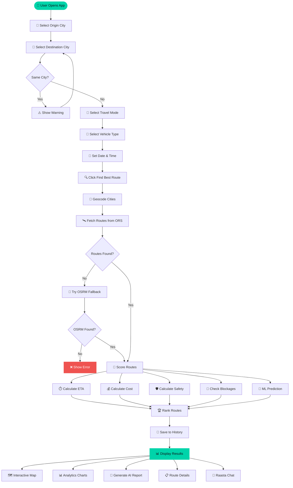
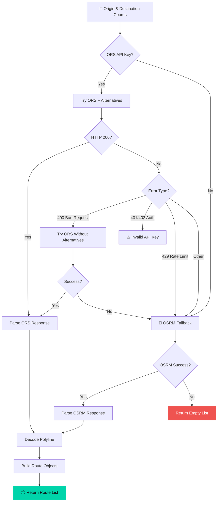
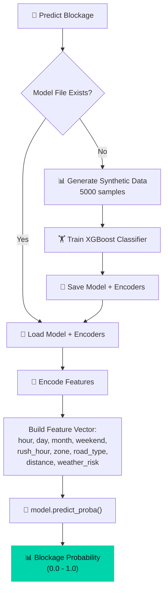
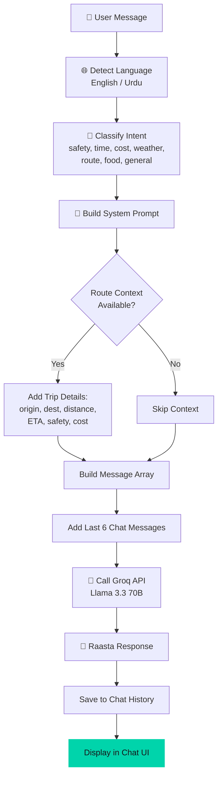
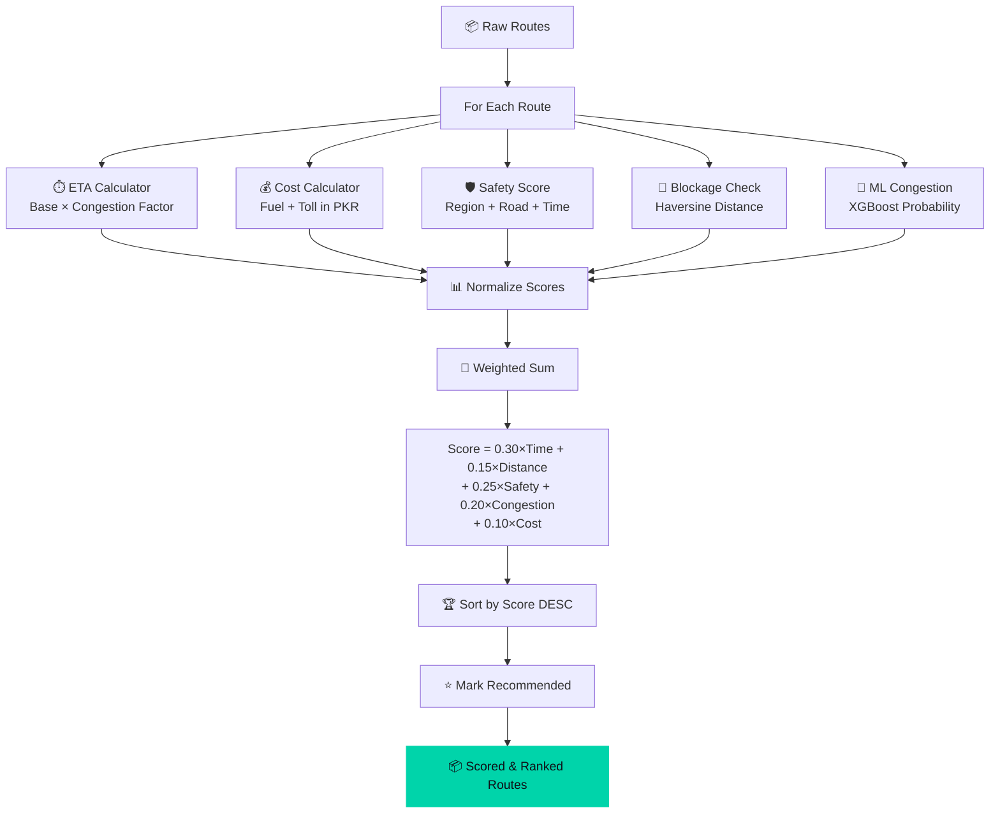

# 🔄 Flow Diagrams

## 1. User Flow — Route Search

```mermaid
flowchart TD
    Start(["🚀 User Opens App"]) --> SelectOrigin["📍 Select Origin City"]
    SelectOrigin --> SelectDest["🏁 Select Destination City"]
    SelectDest --> ValidateCities{"Same City?"}
    ValidateCities -->|Yes| ShowWarning["⚠️ Show Warning"]
    ShowWarning --> SelectDest
    ValidateCities -->|No| SelectMode["🚗 Select Travel Mode"]
    SelectMode --> SelectVehicle["🚙 Select Vehicle Type"]
    SelectVehicle --> SetDeparture["📅 Set Date & Time"]
    SetDeparture --> ClickSearch["🔍 Click Find Best Route"]
    
    ClickSearch --> GeocodeLocations["📌 Geocode Cities"]
    GeocodeLocations --> FetchRoutes["🛰️ Fetch Routes from ORS"]
    FetchRoutes --> RoutesFound{"Routes Found?"}
    RoutesFound -->|No| TryOSRM["🔄 Try OSRM Fallback"]
    TryOSRM --> OSRMFound{"OSRM Found?"}
    OSRMFound -->|No| ShowError["❌ Show Error"]
    OSRMFound -->|Yes| ScoreRoutes
    RoutesFound -->|Yes| ScoreRoutes["🧠 Score Routes"]
    
    ScoreRoutes --> CalcETA["⏱️ Calculate ETA"]
    ScoreRoutes --> CalcCost["💰 Calculate Cost"]
    ScoreRoutes --> CalcSafety["🛡️ Calculate Safety"]
    ScoreRoutes --> CheckBlockage["🚧 Check Blockages"]
    ScoreRoutes --> PredictML["🤖 ML Prediction"]
    
    CalcETA --> RankRoutes["🏆 Rank Routes"]
    CalcCost --> RankRoutes
    CalcSafety --> RankRoutes
    CheckBlockage --> RankRoutes
    PredictML --> RankRoutes
    
    RankRoutes --> SaveHistory["📜 Save to History"]
    SaveHistory --> DisplayResults["📊 Display Results"]
    
    DisplayResults --> MapView["🗺️ Interactive Map"]
    DisplayResults --> Charts["📊 Analytics Charts"]
    DisplayResults --> AIReport["📝 Generate AI Report"]
    DisplayResults --> Details["📋 Route Details"]
    DisplayResults --> Chat["💬 Raasta Chat"]

    style Start fill:#00D4AA,stroke:#00D4AA,color:#0E1117
    style DisplayResults fill:#00D4AA,stroke:#00D4AA,color:#0E1117
    style ShowError fill:#EF5350,stroke:#EF5350,color:#fff
```

## 2. API Routing Flow — ORS with OSRM Fallback

```mermaid
flowchart TD
    Input["📍 Origin & Destination Coords"] --> HasKey{"ORS API Key?"}
    
    HasKey -->|Yes| TryORS["Try ORS + Alternatives"]
    HasKey -->|No| OSRM["🔄 OSRM Fallback"]
    
    TryORS --> ORSSuccess{"HTTP 200?"}
    ORSSuccess -->|Yes| ParseORS["Parse ORS Response"]
    ORSSuccess -->|No| CheckError{"Error Type?"}
    
    CheckError -->|"400 Bad Request"| TrySimple["Try ORS Without Alternatives"]
    CheckError -->|"401/403 Auth"| ShowAuthError["⚠️ Invalid API Key"]
    CheckError -->|"429 Rate Limit"| OSRM
    CheckError -->|"Other"| OSRM
    
    TrySimple --> SimpleSuccess{"Success?"}
    SimpleSuccess -->|Yes| ParseORS
    SimpleSuccess -->|No| OSRM
    
    OSRM --> OSRMSuccess{"OSRM Success?"}
    OSRMSuccess -->|Yes| ParseOSRM["Parse OSRM Response"]
    OSRMSuccess -->|No| Empty["Return Empty List"]
    
    ParseORS --> DecodeGeometry["Decode Polyline"]
    ParseOSRM --> DecodeGeometry
    DecodeGeometry --> BuildRoutes["Build Route Objects"]
    BuildRoutes --> Output["📦 Return Route List"]

    style Output fill:#00D4AA,stroke:#00D4AA,color:#0E1117
    style Empty fill:#EF5350,stroke:#EF5350,color:#fff
```

## 3. ML Prediction Flow

```mermaid
flowchart TD
    Request["🔮 Predict Blockage"] --> ModelExists{"Model File Exists?"}
    ModelExists -->|Yes| LoadModel["📂 Load Model + Encoders"]
    ModelExists -->|No| GenerateData["📊 Generate Synthetic Data<br/>5000 samples"]
    
    GenerateData --> TrainModel["🏋️ Train XGBoost Classifier"]
    TrainModel --> SaveModel["💾 Save Model + Encoders"]
    SaveModel --> LoadModel
    
    LoadModel --> EncodeFeatures["🔢 Encode Features"]
    EncodeFeatures --> BuildVector["Build Feature Vector:<br/>hour, day, month, weekend,<br/>rush_hour, zone, road_type,<br/>distance, weather_risk"]
    BuildVector --> Predict["🤖 model.predict_proba()"]
    Predict --> Output["📊 Blockage Probability<br/>(0.0 - 1.0)"]

    style Output fill:#00D4AA,stroke:#00D4AA,color:#0E1117
```

## 4. Raasta Chatbot Flow

```mermaid
flowchart TD
    UserMsg["💬 User Message"] --> DetectLang["🌐 Detect Language<br/>English / Urdu"]
    DetectLang --> ClassifyIntent["🎯 Classify Intent<br/>safety, time, cost, weather,<br/>route, food, general"]
    ClassifyIntent --> BuildPrompt["📝 Build System Prompt"]
    BuildPrompt --> AddContext{"Route Context<br/>Available?"}
    AddContext -->|Yes| AddRouteData["Add Trip Details:<br/>origin, dest, distance,<br/>ETA, safety, cost"]
    AddContext -->|No| SkipContext["Skip Context"]
    AddRouteData --> BuildMessages["Build Message Array"]
    SkipContext --> BuildMessages
    BuildMessages --> AddHistory["Add Last 6 Chat Messages"]
    AddHistory --> CallGroq["🤖 Call Groq API<br/>Llama 3.3 70B"]
    CallGroq --> Response["💬 Raasta Response"]
    Response --> SaveChat["Save to Chat History"]
    SaveChat --> Display["Display in Chat UI"]

    style Display fill:#00D4AA,stroke:#00D4AA,color:#0E1117
```

## 5. Scoring Algorithm Flow

```mermaid
flowchart TD
    Input["📦 Raw Routes"] --> Loop["For Each Route"]
    
    Loop --> CalcETA["⏱️ ETA Calculator<br/>Base × Congestion Factor"]
    Loop --> CalcCost["💰 Cost Calculator<br/>Fuel + Toll in PKR"]
    Loop --> CalcSafety["🛡️ Safety Score<br/>Region + Road + Time"]
    Loop --> CheckBlock["🚧 Blockage Check<br/>Haversine Distance"]
    Loop --> MLPredict["🤖 ML Congestion<br/>XGBoost Probability"]
    
    CalcETA --> Normalize
    CalcCost --> Normalize
    CalcSafety --> Normalize
    CheckBlock --> Normalize
    MLPredict --> Normalize
    
    Normalize["📊 Normalize Scores"] --> WeightedSum["🧮 Weighted Sum"]
    
    WeightedSum --> Formula["Score = 0.30×Time + 0.15×Distance<br/>+ 0.25×Safety + 0.20×Congestion<br/>+ 0.10×Cost"]
    
    Formula --> Sort["🏆 Sort by Score DESC"]
    Sort --> MarkBest["⭐ Mark Recommended"]
    MarkBest --> Output["📦 Scored & Ranked Routes"]

    style Output fill:#00D4AA,stroke:#00D4AA,color:#0E1117
```
