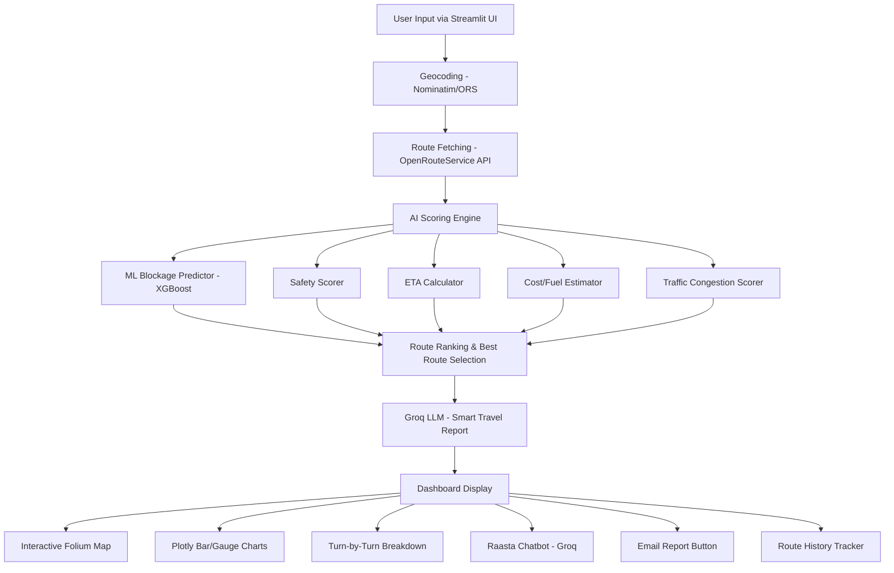

# Safar-AI — Smart Route Predictor: Implementation Plan

## 🎯 Idea Summary

**Safar-AI** is Pakistan's first AI-powered smart route predictor — a Streamlit web app that helps commuters, travelers, and logistics managers make intelligent travel decisions. The user provides origin, destination, travel mode, and departure time. The system fetches multiple routes via **OpenRouteService API**, scores them with an **AI Scoring Engine** (ML + heuristic), generates a **Smart Travel Report** via **Groq LLM**, and displays everything on an interactive dashboard with maps, charts, and a chatbot named **"Raasta"**.

---

## 📐 System Architecture



---

## 🔧 Tools, APIs & Libraries

| Category | Tool | Free? | Purpose |
|---|---|---|---|
| **Frontend** | Streamlit | ✅ | App UI framework |
| **Maps** | Folium + streamlit-folium | ✅ | Interactive map display |
| **Routing API** | OpenRouteService (ORS) | ✅ 2,000 req/day | Multi-route directions + geocoding |
| **Geocoding** | Geopy (Nominatim) | ✅ | Address → lat/lng conversion |
| **LLM** | Groq API (Llama 3.3 70B) | ✅ 1,000 req/day | Travel reports + chatbot |
| **ML** | scikit-learn + XGBoost | ✅ | Blockage/congestion prediction |
| **Charts** | Plotly | ✅ | Bar charts, gauges, comparisons |
| **Email** | smtplib (Gmail SMTP) | ✅ | Send travel reports via email |
| **Data** | pandas, numpy | ✅ | Data processing |
| **Serialization** | joblib | ✅ | Save/load ML models |
| **NLP** | langdetect, fuzzywuzzy | ✅ | Language detection, fuzzy city match |
| **Config** | python-dotenv | ✅ | Environment variable management |

> [!IMPORTANT]
> **API Keys Required (all free):**
> 1. **ORS_API_KEY** — from [openrouteservice.org](https://openrouteservice.org) (free signup)
> 2. **GROQ_API_KEY** — from [console.groq.com](https://console.groq.com) (free signup)
> 3. **GMAIL_APP_PASSWORD** — from Google Account → App Passwords (for email feature)

---

## 🧠 AI/ML Model Approach

### Blockage & Congestion Predictor (XGBoost)

Since real-time traffic data APIs are paid, we use a **synthetic-data-trained XGBoost classifier** that predicts blockage probability based on features a user would know at query time:

**Features (input vector):**
| Feature | Type | Description |
|---|---|---|
| `hour` | int (0-23) | Departure hour |
| `day_of_week` | int (0-6) | Day of week (Mon=0) |
| `month` | int (1-12) | Month of year |
| `is_weekend` | bool | Weekend flag |
| `is_rush_hour` | bool | Peak hours (7-9 AM, 5-8 PM) |
| `road_type` | categorical | Highway / Urban / Rural |
| `distance_km` | float | Route distance |
| `city_zone` | categorical | Origin city zone |
| `weather_risk` | float (0-1) | Seasonal weather risk (monsoon etc.) |

**Output:** `blockage_probability` (0.0 – 1.0) — used as congestion score.

**Training:** We generate ~5,000 synthetic training samples based on realistic Pakistan traffic patterns (rush hours, monsoon months, urban vs highway, Friday prayers, etc.) and train an XGBoost model at app startup if no saved model exists.

---

## 📊 Route Scoring Algorithm

Each route from ORS is scored using a **weighted multi-factor formula**:

```
Route Score = (w1 × Time_Score) + (w2 × Distance_Score) + (w3 × Safety_Score)
            + (w4 × Congestion_Score) + (w5 × Cost_Score)
```

| Factor | Weight | Calculation |
|---|---|---|
| **Time Score** | 0.30 | `1 - (route_time / max_time)` — lower time = higher score |
| **Distance Score** | 0.15 | `1 - (route_dist / max_dist)` — shorter = better |
| **Safety Score** | 0.25 | Lookup from `safety_index.json` + time-of-day modifier (night penalty) |
| **Congestion Score** | 0.20 | `1 - blockage_probability` from ML model |
| **Cost Score** | 0.10 | `1 - (fuel_cost / max_fuel_cost)` — cheaper = better |

**Final Score** is normalized to **0–100**. The route with the highest score is recommended.

---

## 📋 JSON Contracts

### 1. User Input → Route Engine

```json
{
  "origin": "Lahore, Pakistan",
  "destination": "Islamabad, Pakistan",
  "origin_coords": [74.3587, 31.5204],
  "destination_coords": [73.0479, 33.6844],
  "travel_mode": "driving-car",
  "departure_time": "2026-05-03T08:00:00",
  "vehicle_type": "sedan"
}
```

### 2. Route Engine → Scoring Engine

```json
{
  "routes": [
    {
      "route_id": 1,
      "summary": "M-2 Motorway via GT Road",
      "distance_km": 375.2,
      "duration_min": 245.0,
      "geometry": [[74.35, 31.52], ...],
      "steps": [
        {"instruction": "Head north on Mall Road", "distance_km": 1.2, "duration_min": 3}
      ],
      "bbox": [73.04, 31.52, 74.36, 33.68]
    }
  ]
}
```

### 3. Scored Routes → Groq LLM

```json
{
  "trip_info": {
    "origin": "Lahore",
    "destination": "Islamabad",
    "mode": "driving-car",
    "departure": "2026-05-03T08:00:00",
    "vehicle": "sedan"
  },
  "scored_routes": [
    {
      "route_id": 1,
      "summary": "M-2 Motorway",
      "distance_km": 375.2,
      "duration_min": 245.0,
      "score": 87.5,
      "safety_rating": 82,
      "congestion_score": 0.15,
      "fuel_cost_pkr": 4500,
      "is_recommended": true,
      "steps_summary": ["Head north on Mall Road", "Merge onto M-2", ...]
    }
  ],
  "request": "Provide a Smart Travel Report analyzing these routes."
}
```

### 4. Groq LLM → Dashboard

```json
{
  "recommended_route": "M-2 Motorway",
  "analysis": "The M-2 Motorway route is recommended because...",
  "risks": ["Morning fog near Sheikhupura in winter months", ...],
  "alternatives_note": "GT Road is 30 min longer but has more fuel stations...",
  "travel_tips": ["Depart before 7 AM to avoid Lahore city traffic", ...],
  "safety_advisory": "Overall safe route. Score: 82/100.",
  "cost_breakdown": {"fuel": 4500, "toll": 800, "total": 5300}
}
```

### 5. Route History Record

```json
{
  "timestamp": "2026-05-03T08:15:00",
  "origin": "Lahore",
  "destination": "Islamabad",
  "mode": "driving-car",
  "best_route": "M-2 Motorway",
  "score": 87.5,
  "eta_min": 245,
  "cost_pkr": 5300
}
```

---

## 📁 Final Folder Structure

> [!NOTE]
> We keep your existing structure and add missing files. Files marked **[NEW]** are new; **[MODIFY]** have content to be written into existing empty files.

```
Safar-AI-Smart-Route-Predictor/
├── .streamlit/
│   └── config.toml              [MODIFY] — dark theme + custom colors
├── .gitignore                   [NEW]
├── .env.example                 [NEW]
├── LICENSE                      (exists — MIT)
├── README.md                    [MODIFY] — full professional README
├── requirements.txt             [MODIFY] — trimmed for Streamlit Cloud compatibility
├── app.py                       [MODIFY] — main Streamlit entry point (multi-page router)
│
├── agent/                       — Raasta AI Chatbot Module
│   ├── __init__.py              [MODIFY]
│   ├── raasta.py                [MODIFY] — Groq-powered chatbot logic
│   ├── intent.py                [MODIFY] — intent classification for chat
│   └── language.py              [MODIFY] — Urdu/English language detection
│
├── engine/                      — Core Route Intelligence Engine
│   ├── __init__.py              [MODIFY]
│   ├── routing.py               [MODIFY] — ORS API integration, multi-route fetch
│   ├── scoring.py               [NEW]    — weighted route scoring algorithm
│   ├── safety.py                [MODIFY] — safety index lookup + time modifier
│   ├── cost.py                  [MODIFY] — fuel/toll cost calculator (PKR)
│   ├── eta.py                   [MODIFY] — ETA with congestion adjustment
│   └── blockage.py              [MODIFY] — blockage data integration
│
├── ml/                          — Machine Learning Module
│   ├── __init__.py              [MODIFY]
│   ├── train_blockage.py        [MODIFY] — synthetic data gen + XGBoost training
│   └── predict.py               [MODIFY] — blockage probability inference
│
├── map/                         — Map Visualization Module
│   ├── __init__.py              [MODIFY]
│   ├── base_map.py              [MODIFY] — Folium base map creation
│   ├── route_layer.py           [MODIFY] — draw routes on map with colors
│   ├── blockage_layer.py        [MODIFY] — blockage markers
│   ├── heatmap_layer.py         [MODIFY] — congestion heatmap overlay
│   └── poi_layer.py             [MODIFY] — points of interest (rest areas, fuel)
│
├── groq_ai/                     [NEW]    — Groq LLM Integration Module
│   ├── __init__.py              [NEW]
│   ├── report.py                [NEW]    — Smart Travel Report generator
│   └── chat.py                  [NEW]    — Chat completion wrapper
│
├── email_service/               [NEW]    — Email Report Module
│   ├── __init__.py              [NEW]
│   └── sender.py                [NEW]    — SMTP email with HTML report
│
├── dashboard/                   [NEW]    — Dashboard Charts & Widgets
│   ├── __init__.py              [NEW]
│   ├── charts.py                [NEW]    — Plotly bar charts, gauge, comparisons
│   └── widgets.py               [NEW]    — reusable Streamlit UI components
│
├── data/                        — Static Data Files
│   ├── pakistan_cities.json      [MODIFY] — city name → coords mapping
│   ├── fuel_prices.json         [MODIFY] — fuel prices in PKR per liter
│   ├── vehicle_config.json      [MODIFY] — vehicle fuel consumption rates
│   ├── safety_index.json        [MODIFY] — region-based safety scores
│   ├── blockages.json           [MODIFY] — known blockage hotspots
│   └── rest_areas.json          [MODIFY] — rest stops along major routes
│
├── database/                    — Session Storage
│   ├── __init__.py              [MODIFY]
│   └── db.py                    [MODIFY] — JSON-based session history (no SQLite needed)
│
├── utils/                       [NEW]    — Shared Utilities
│   ├── __init__.py              [NEW]
│   └── helpers.py               [NEW]    — geocoding, formatting, validation
│
└── docs/                        — Documentation
    ├── README.md                (exists)
    ├── Safar_AI_Semester_Proposal.docx
    └── Safar_AI_Semester_Proposal.pdf
```

---

## 🚀 Phased Execution Plan

### Phase 1: Foundation (Data + Config + Utils)
- Populate all JSON data files with realistic Pakistan data
- Create `.env.example`, `.gitignore`, `.streamlit/config.toml`
- Build `utils/helpers.py` (geocoding, validation, formatters)
- Write trimmed `requirements.txt` (Streamlit Cloud compatible — no osmnx/textract)

### Phase 2: Routing Engine (ORS Integration)
- `engine/routing.py` — fetch 3 alternative routes from ORS API
- `engine/eta.py` — ETA calculation with time-of-day adjustment
- `engine/cost.py` — fuel + toll cost in PKR
- `engine/safety.py` — safety score from data + night modifier
- `engine/blockage.py` — known blockage zone checker

### Phase 3: ML Model
- `ml/train_blockage.py` — generate synthetic data + train XGBoost
- `ml/predict.py` — load model + predict blockage probability
- `engine/scoring.py` — combine all factors into weighted route score

### Phase 4: Map Visualization
- `map/base_map.py` — create Folium map centered on route
- `map/route_layer.py` — draw all routes (green=best, grey=others)
- `map/blockage_layer.py` — red markers for blockages
- `map/poi_layer.py` — rest areas, fuel stations

### Phase 5: Groq LLM Integration
- `groq_ai/report.py` — send scored routes JSON → get Smart Travel Report
- `groq_ai/chat.py` — Raasta chatbot completions wrapper
- `agent/raasta.py` — chatbot with route context
- `agent/intent.py` — classify user query intent
- `agent/language.py` — detect Urdu vs English

### Phase 6: Dashboard & Main App
- `dashboard/charts.py` — Plotly charts (route comparison, safety gauge, cost breakdown)
- `dashboard/widgets.py` — metric cards, route detail expanders
- `app.py` — main Streamlit app with sidebar input + tabbed dashboard

### Phase 7: Email + History + Polish
- `email_service/sender.py` — HTML email with report
- `database/db.py` — JSON session history
- `README.md` — professional documentation
- Final testing & cleanup

---

## User Review Required

> [!IMPORTANT]
> **Requirements.txt Trimming:** Your current `requirements.txt` includes heavy packages (`osmnx`, `geopandas`, `textract`, `tabula-py`, `pymupdf`) that will **fail or be very slow** on Streamlit Cloud (1GB RAM limit). Since we use ORS API for routing (not local OSM graph), I'll remove `osmnx`, `geopandas`, `pyproj`, `networkx`, `shapely` and all document-reading packages. **Is this acceptable?**

> [!IMPORTANT]
> **No real-time traffic data:** Free APIs don't provide live traffic. Our congestion scores come from the ML model (time/day/season patterns) + static blockage data. The system will be transparent about this. **Is this approach acceptable?**

> [!WARNING]
> **Email Feature:** Gmail SMTP requires an App Password (2FA must be enabled). The user will need to enter their email + the app's Gmail credentials in `.env`. On Streamlit Cloud, these go in Secrets. **Shall I proceed with this approach?**

## Open Questions

1. **Pakistan-focused only?** Your README says "Pakistan's first AI-powered smart route predictor." Should the city list and data be Pakistan-only, or should we support worldwide routes via ORS?
2. **Vehicle types:** Should we support Car, Motorcycle, Rickshaw, Bus? (affects fuel calculation)
3. **Urdu UI text:** Should the Streamlit UI labels also have Urdu translations, or just the chatbot?

---

## Verification Plan

### Automated Tests
- Run `streamlit run app.py` locally and test all input combinations
- Verify ORS API returns valid routes for Pakistan city pairs
- Verify Groq API returns properly formatted travel reports
- Test email sending with a test Gmail account
- Test route history save/load across session

### Manual Verification
- Visual check of map rendering (routes, markers, colors)
- Chart rendering (Plotly bar, gauge, breakdowns)
- Chatbot conversation flow (Urdu + English)
- Streamlit Cloud deployment test from GitHub
