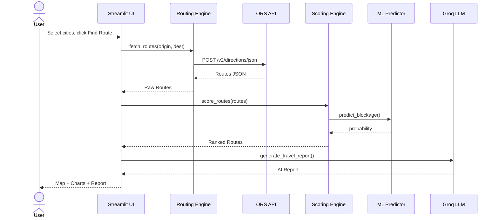
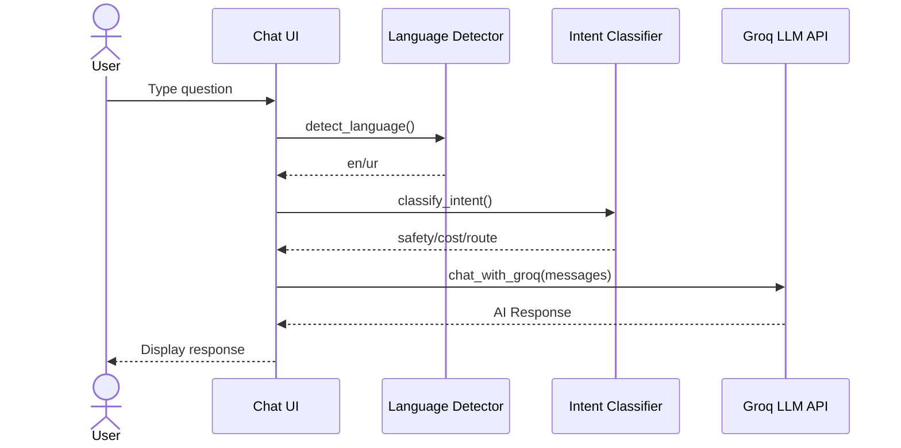

# 🔀 Sequence Diagrams

## Route Search Sequence

```mermaid
sequenceDiagram
    actor User
    participant UI as Streamlit UI
    participant Router as Routing Engine
    participant ORS as ORS API
    participant Scorer as Scoring Engine
    participant ML as ML Predictor
    participant Groq as Groq LLM

    User->>UI: Select cities, click Find Route
    UI->>Router: fetch_routes(origin, dest)
    Router->>ORS: POST /v2/directions/json
    ORS-->>Router: Routes JSON
    Router-->>UI: Raw Routes
    UI->>Scorer: score_routes(routes)
    Scorer->>ML: predict_blockage()
    ML-->>Scorer: probability
    Scorer-->>UI: Ranked Routes
    UI->>Groq: generate_travel_report()
    Groq-->>UI: AI Report
    UI-->>User: Map + Charts + Report
```

## Raasta Chat Sequence

```mermaid
sequenceDiagram
    actor User
    participant Chat as Chat UI
    participant Lang as Language Detector
    participant Intent as Intent Classifier
    participant Groq as Groq LLM API

    User->>Chat: Type question
    Chat->>Lang: detect_language()
    Lang-->>Chat: en/ur
    Chat->>Intent: classify_intent()
    Intent-->>Chat: safety/cost/route
    Chat->>Groq: chat_with_groq(messages)
    Groq-->>Chat: AI Response
    Chat-->>User: Display response
```
