# 🏗️ System Architecture Diagram

## High-Level Architecture

```mermaid
graph TB
    subgraph Client["🖥️ Client Layer"]
        Browser["Web Browser"]
    end

    subgraph Frontend["🎨 Frontend - Streamlit"]
        App["app.py<br/>Main Entry Point"]
        Sidebar["Sidebar Controls<br/>City, Mode, Vehicle, Time"]
        Tabs["Tab Navigation"]
        
        subgraph TabViews["Tab Views"]
            MapTab["🗺️ Map View"]
            ChartTab["📊 Analytics"]
            ReportTab["📝 AI Report"]
            DetailsTab["📋 Route Details"]
            ChatTab["💬 Raasta Chat"]
            HistoryTab["📜 History"]
        end
    end

    subgraph Backend["⚙️ Backend Engine"]
        Router["🛰️ Routing Engine<br/>routing.py"]
        Scorer["🧠 Scoring Engine<br/>scoring.py"]
        Safety["🛡️ Safety Calculator<br/>safety.py"]
        ETA["⏱️ ETA Calculator<br/>eta.py"]
        Cost["💰 Cost Calculator<br/>cost.py"]
        Blockage["🚧 Blockage Checker<br/>blockage.py"]
    end

    subgraph ML["🤖 Machine Learning"]
        Predictor["Blockage Predictor<br/>predict.py"]
        Trainer["XGBoost Trainer<br/>train_blockage.py"]
        Model["blockage_model.joblib"]
    end

    subgraph AI["🧠 AI Layer - Groq"]
        Chat["Chat Wrapper<br/>chat.py"]
        Report["Report Generator<br/>report.py"]
        Raasta["Raasta Chatbot<br/>raasta.py"]
    end

    subgraph MapLayer["🗺️ Map Visualization"]
        BaseMap["Base Map<br/>Folium Dark"]
        RouteLayer["Route Polylines"]
        BlockageMarkers["Blockage Markers"]
        POIMarkers["REST Area Markers"]
    end

    subgraph Data["📦 Data Layer"]
        Cities["pakistan_cities.json"]
        FuelPrices["fuel_prices.json"]
        VehicleConfig["vehicle_config.json"]
        SafetyIndex["safety_index.json"]
        Blockages["blockages.json"]
        RestAreas["rest_areas.json"]
    end

    subgraph External["🌐 External APIs"]
        ORS["OpenRouteService API"]
        OSRM["OSRM API<br/>(Fallback)"]
        GroqAPI["Groq LLM API<br/>Llama 3.3 70B"]
    end

    Browser --> App
    App --> Sidebar
    App --> Tabs
    Tabs --> TabViews

    Sidebar -->|User Input| Router
    Router -->|Routes| Scorer
    Scorer --> Safety
    Scorer --> ETA
    Scorer --> Cost
    Scorer --> Blockage
    Scorer --> Predictor

    Predictor --> Model
    Trainer --> Model

    Router --> ORS
    Router -->|Fallback| OSRM
    Chat --> GroqAPI
    Report --> Chat
    Raasta --> Chat

    MapTab --> BaseMap
    BaseMap --> RouteLayer
    BaseMap --> BlockageMarkers
    BaseMap --> POIMarkers

    ChartTab --> Scorer
    ReportTab --> Report
    ChatTab --> Raasta
    HistoryTab --> Data

    Safety --> SafetyIndex
    Cost --> FuelPrices
    Cost --> VehicleConfig
    Blockage --> Blockages
    POIMarkers --> RestAreas
    Router --> Cities

    style Frontend fill:#1A1F2E,stroke:#00D4AA,color:#FAFAFA
    style Backend fill:#1A2E1A,stroke:#00D4AA,color:#FAFAFA
    style ML fill:#2E1A2E,stroke:#CE93D8,color:#FAFAFA
    style AI fill:#1A2E2E,stroke:#4FC3F7,color:#FAFAFA
    style External fill:#2E1A1A,stroke:#EF5350,color:#FAFAFA
    style Data fill:#1A1F2E,stroke:#FFB74D,color:#FAFAFA
```



## Request Flow

```
User Input → Streamlit UI → Routing Engine → ORS/OSRM API
                                    ↓
                            Scoring Engine
                        ↙    ↙    ↓    ↘    ↘
                   ETA  Safety  Cost  Blockage  ML
                        ↘    ↘    ↓    ↙    ↙
                          Ranked Routes
                                ↓
                    Map + Charts + AI Report
```
